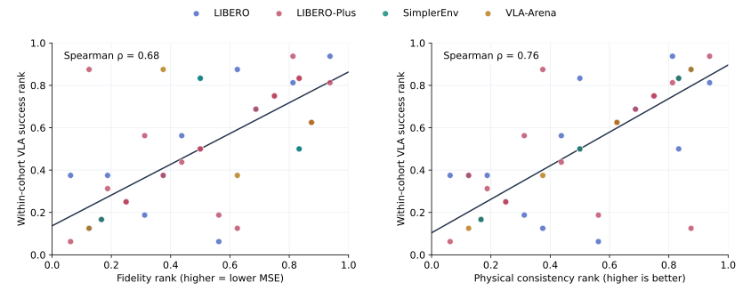

# ActionPiece

**Rethinking Action Tokenization for Autoregressive Vision-Language-Action Models**

## Abstract

Action reconstruction fidelity and physical consistency are both important for closed-loop robot control. Across 61 matched tokenizer–benchmark evaluations, both properties are associated with policy success, while neither alone fully explains the observed performance. ActionPiece achieves 94.80% on LIBERO, 68.77% on unseen LIBERO-Plus, 71.9% on SimplerEnv, and 51.45% mean success across VLA-Arena L0–L2.

[PhysBrain1.5](https://huggingface.co/collections/DeepCybo/physbrain-15) uses **ActionPiece** as its **action tokenizer**.

## Key Insight

**Fidelity and physical consistency both matter.** Both are positively associated with closed-loop success across matched evaluations. Neither property alone fully determines performance.

Ranks are normalized within each comparison cohort; color indicates the benchmark. These associations do not establish causation.

## Benchmark Results

| Benchmark | ActionPiece success rate |
| --- | ---: |
| LIBERO | 94.80% |
| LIBERO-Plus | 68.77% |
| SimplerEnv | 71.9% |
| VLA-Arena L0 | 82.18% |
| VLA-Arena L1 | 42.73% |
| VLA-Arena L2 | 29.45% |
| VLA-Arena overall | 51.45% |

LIBERO-Plus demonstrations are excluded from policy training. SimplerEnv reports the highest of five independent 24-episode repeats per task, macro-averaged over four tasks. VLA-Arena averages 11 task suites equally at each level and all 33 suite–level cells overall. The project page includes the full comparisons, with updated LingBot-VLA and Motus results.

